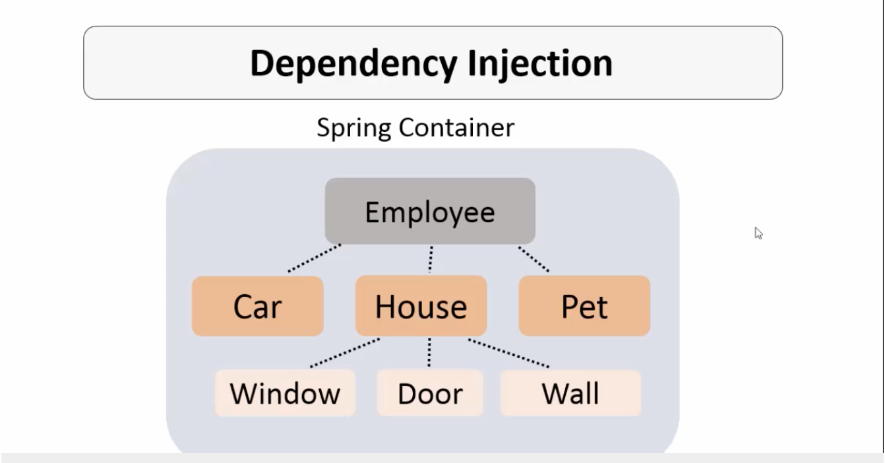
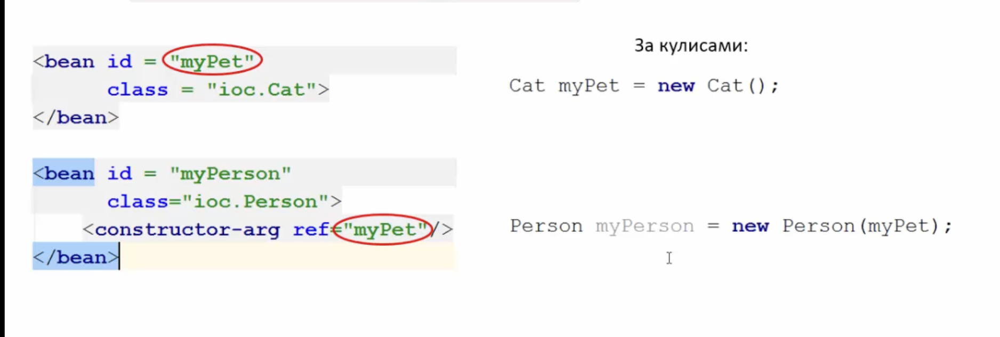
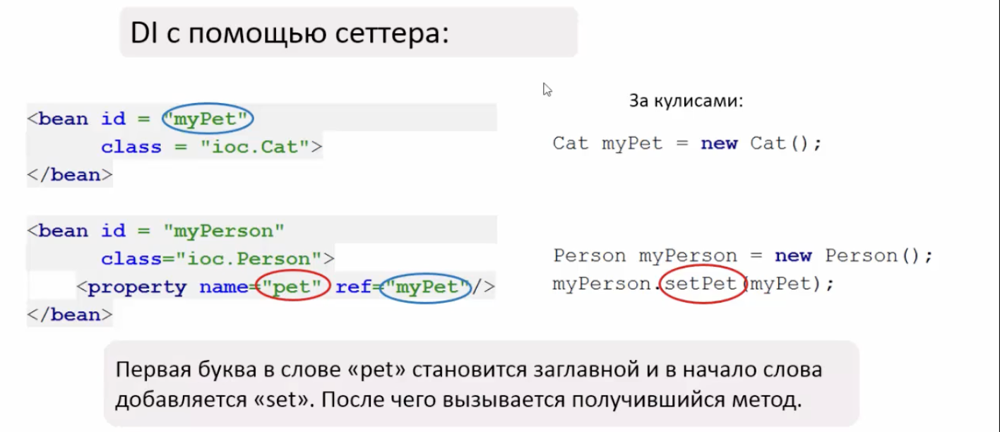

#SPRING

##Inversion of Control

**Inversion of Control** - это процесс передачи прав на создание и управления объектами.

**Spring Bean(или просто bean)** - это объект, который создается и управляется Spring Container.

***Application Context*** представляет собой ***Spring Container***. Поэтому для получения Бина из Spring Container нам нужно создать Application Context. 

##DEPENDENCY INJECTION

**DEPENDENCY INJECTION** -  Внедрение зависимостей.

Spring автоматически за нас создает зависимости между классами, чтобы нам не писать их самим.

**Основные функции, которые выполняет Spring Container:**. 

* 	 IoC - инверсия управления, Создание и управление объектами 
*	 DI - Dependency Injection Внедрение зависимостей.

**DI** -  аутсорсинг добавление / внедрение зависимостей. DI делает объекты нашего приложения слабо зависимыми друг от друга.

**Способы внедрения зависимостей:**  

* С помощью конструктора
* С помощью сеттеров
* Autowiring

**_*ВСЕГДА ЗАКРЫВАЙ КОНТЕКСТ ПРИЛОЖЕНИЯ (context.close())*_**. 


Вызов context.close() выполняет различные действия, такие как освобождение ресурсов, закрытие подключений и завершение жизненного цикла управляемых бинов. В общем, это чистит за собой ресурсы, которые были выделены при создании контекста.

**DI с помощью конструктора:**  

* Constructor-arg - аргумент конструктора
* ref - ссылка на id bean	

**DI с помощью сеттера:**  

**Внедрение строк и других значений:**  

